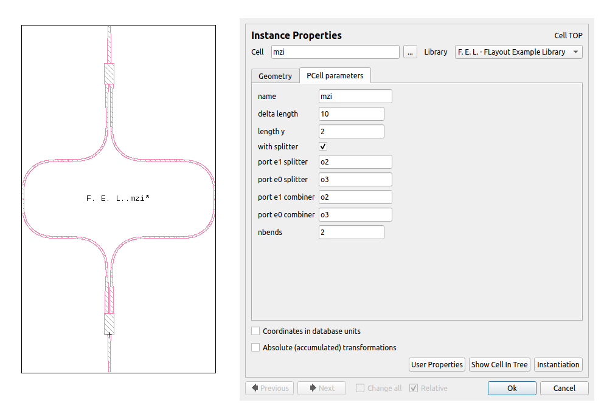

# FLayout
> My personal KLayout wrappers and utility functions


## Archived

**Consider this project archived as I don't have time to maintain it. Feel free to use whatever you deem useful in your own klayout-based projects.**

## Installation

```sh
pip install flayout
```

### Development installation

```sh
git clone https://github.com/flaport/flayout
cd flayout
conda env update # create conda environment 'fl' with klayout (python library) and klayout-gui (GUI)
pip install -e .
```

It would be cool if a [salt](https://www.klayout.de/package_cookbook.html) package for this library would exist.

Note that this package might not work on Windwos... I never took the time to test it there...

## Easy PCells

This library offers a klayout [PCell decorator](https://flaport.github.io/flayout/pcell), which is much easier to use than the default PCell offered by the KLayout api. Moreover, the PCell decorator can be with a [GDSFactory](https://github.com/gdsfactory/gdsfactory) component function (or any function that produces a [gdspy](https://github.com/heitzmann/gdspy) cell) as well!

## Use with KLayout

First install flayout as a system python package:

```sh
cd /path/to/flayout
pip install --user .
```

Alternatively, you can also open the klayout gui from *within* the `fl` python environment (linux only)

Then within klayout add a simple macro to import the flayout example library

```python
from flayout.example_lib import *
```

Note that running this macro takes a while in KLayout (about 10 seconds).

After running the macro, open a new gdsfile and find the Flayout PCells in the "F.E.L - Flayout Example Library", which supplies two gdsfactory-defined components: the mzi and euler bend. These components are now imported as PCells!



You can have a look at how the [example library](flayout/example_lib.py) is implemented and try something similar for yourself!

## Quick Docs


- **FLayout**
  - Overview
  - [Factories](https://flaport.github.io/flayout/factories)     ⬅ start here.
  - [Cell Utilities](https://flaport.github.io/flayout/cell)
  - [PCell Decorator](https://flaport.github.io/flayout/pcell)
  - [Read &amp; Write](https://flaport.github.io/flayout/io)
- **Extensions**
  - [Bokeh Visualization](https://flaport.github.io/flayout/bokeh)
  - [Notebook](https://flaport.github.io/flayout/notebook)
- **Libraries**
  - [Example Library](https://flaport.github.io/flayout/example_lib)


## NBDev

This project was created using [nbdev1](https://nbdev1.fast.ai/). An awesome [literate programming](https://en.wikipedia.org/wiki/Literate_programming) environment for python.

## License

As this library can be considered a light wrapper for the KLayout python api, I chose license it under [GPLv3](LICENSE).
